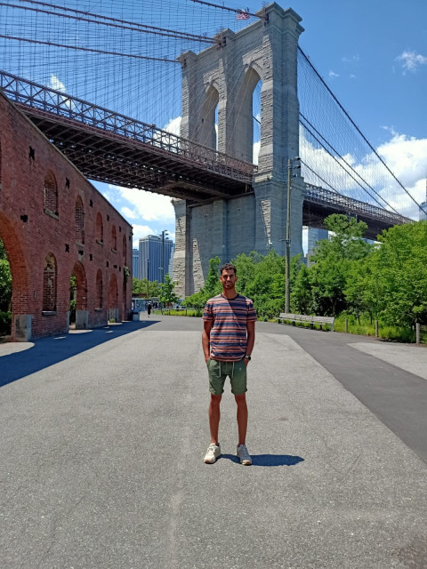

## About me

I'm a human who loves software engineering and sports. If I'm not coding, I'm probably cycling, swimming, or running.

## My values

- Kaizen, can we do better?.
- Committed.
- Honest.
- Agility.
- Assertive.

## Company attributes I care about:

- Flexible work arrangements.
- High-quality codebase.
- Mentorship culture.
- Stable company.
- Work/life balance.

## Team & company values I care about:

- Heavily team/collaboration oriented.
- Promotes end-to-end ownership.
- Practices open, honest, and transparent communication.
- Continuous feedback culture.
- Contributes to open source projects.

## Things I struggle with:

- Meetings without a clear goal and lack of decisiveness & actions.
- Bureaucracy, strict and formal processes, status quo and a lack of willingness to change that.

## Things I love:

- My wife and 2 kids.
- The beauty of a nice tiny clean code.
- Helping out colleagues.
- Do my best on my training days.
- Cooking with a podcast or music.
- Swim in the wild sea.
- Innovation by reading about current tech trends.
- Inspiring people with the things I love.
- Brainstorm about new ideas, innovations, events, and workshops.
- Read technical books.
- Code challenges.

## My black list Industries:

- Finance
- Marketing
